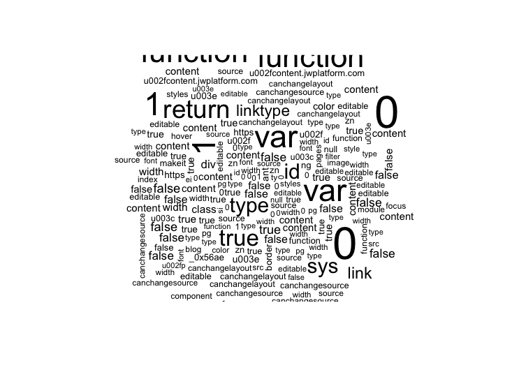
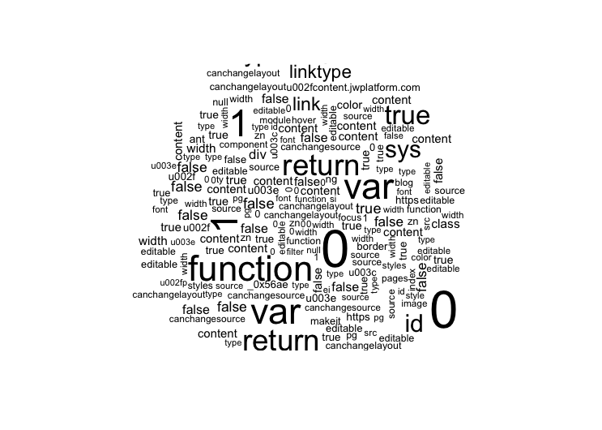

# README

2020-09-24

- The data are re-organized into a directory under `data`, and categorized into:
  - `data/hackathon/data/articles.json`
  - `data/hackathon/data/comments_recent.json` and `data/hackathon/data/comments*.json`
  - `data/content` and `data/content.sqlite` (not tracked with git)

- Load `tidy_data.RData` to read the following tidy data:
  - `tidy_data`:
    - `time` as date
    - `a_num` as the number of articles on that day
    - `c_num` as the total number of comments on that day
    - `score` as the highest score of a single article on that day
  - `tidy_data_impute`: the same as `tidy_data` but `NA` linearly interpolated
  - `comments_raw`:
    - Everything about comments excluding `comments_recent.json`
  - `articles_by_day`, `daily_top`, `comments_by_day`
  

- About missing data in the number of comments, linear interpolation might be the beat approach since spline and Stineman would bring some negative point estimates.


# Data Updating Procedure

> I've done this once. If you need to try with updated data, do the following:

- [x] need to manually update contents
- [x] need to update data in submodule `git submodule update --remote --merge`

# Challenge 1 - "Warm up predictions"

I haven't done too much on model comparison, ~~especially for the number of comments since the **given** data are missing a lot before August 14~~.

Simply put, I just go full ARIMA (~~except for the number of comments since the comments number for the last week spiked, ARIMA would return a negative prediction to "balance" this spike, so I used TBATS~~).

```r
pred_anum <- 93
pred_score <- 1139
pred_cnum <- 1235
```

# Trial on Challenge 4

The rough idea is:

- Clean the `contents` data provided online.
- Aggregate the segments into a tidy tibble. To increase the speed of accessing data, I intentionally store them to a local sqlite database.
- Join the contents with articles based on the same URL both tables share.
- Find the most frequent words in the article contents.
- The most obvious approach to demonstrate this "frequency" is through wordcloud.

I give this workflow a few trials, removing some obvious "stop words" by adding them to the `stop_words` collection.

The results are still not very ideal, with some seemingly-not-so-helpful topic candidates. But I suspect these are highly related to the topic defining though.




