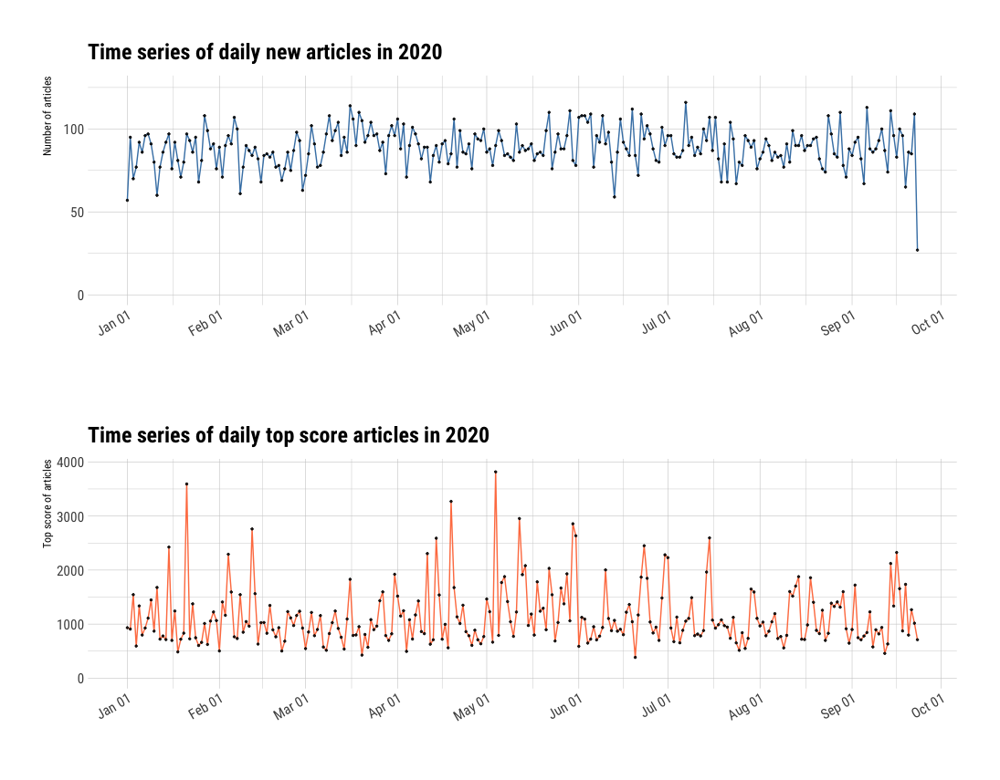
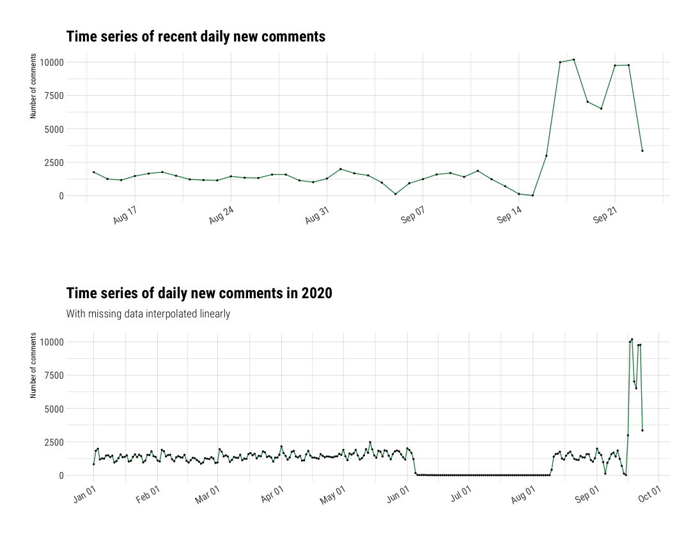

# README

2020-09-24

- The data are re-organized into a directory under `data`, and categorized into:
  - `data/hackathon/data/articles.json`
  - `data/hackathon/data/comments_recent.json` and `data/hackathon/data/comments*.json`
  - `data/content`

- load `tidy_data.RData` to read the following tidy data:
  - `tidy_data`:
    - `time` as date
    - `a_num` as the number of articles on that day
    - `c_num` as the total number of comments on that day
    - `score` as the highest score of a single article on that day
  - `tidy_data_impute`: the same as `tidy_data` but NA linearly interpolated
  - `comments_raw`:
    - everything about comments excluding `comments_recent.json`
  - `articles_by_day`, `daily_top`, `comments_by_day`
  

- About missing data in the number of comments, linear interpolation might be the beat approach since spline and Stineman would bring some negative point estimates.



# Challenge 1 - "Warm up predictions"

i didn't do too much on model comparison. especially for the number of comments since the **given** data are missing a lot before August 14.

simply put, I just went full ARIMA (~~except for the number of comments since the comments number for the last week spiked, ARIMA would return a negative prediction to "balance" this spike, so I used TBATS~~).

```r
pred_anum <- 93
pred_score <- 1139
pred_cnum <- 1235
```

# Challenge 2 - "Segmentation"


# update

- [ ] need to manually update contents
- [ ] need to update data in submodule `git submodule update --remote --merge`

